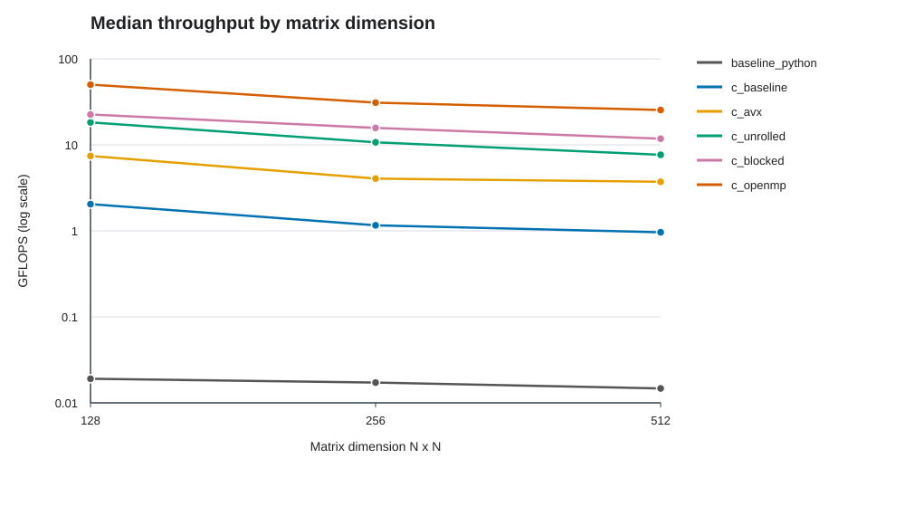

# Relatório de benchmark de multiplicação de matrizes

## Autoria

- EZEQUIEL DE JESUS SANTOS — DRE 121056350
- KELLY PINHEIRO SOARES — DRE 125170716
- LUCAS PEREIRA PACHECO DE MEDEIROS — DRE 126436084
- LUIZA TEIXEIRA BARCELLOS ROSAURO DE ALMEIDA — DRE 126423803

## Resumo

Este trabalho compara seis implementações de multiplicação de matrizes quadradas, avaliadas nas dimensões 128, 256 e 512. Para cada combinação de variante e dimensão, foram realizadas cinco medições, precedidas por uma multiplicação de aquecimento. A implementação `c_openmp` alcançou a maior mediana de desempenho nos três tamanhos: 50,102, 30,970 e 25,405 GFLOPS, respectivamente. Esses resultados descrevem o comportamento observado nesta máquina e neste protocolo; não devem ser generalizados para outros ambientes.

## Introdução

A multiplicação de matrizes é uma operação fundamental em computação científica, processamento de imagens e aprendizado de máquina. DGEMM designa a multiplicação geral de matrizes em precisão dupla da interface BLAS. Em sua forma usual, a operação calcula $C \leftarrow \alpha AB + \beta C$, para matrizes de dimensões compatíveis e escalares $\alpha$ e $\beta$. Este projeto avalia um caso quadrado simplificado, $C \leftarrow AB$, equivalente a $\alpha=1$ e $\beta=0$; portanto, não implementa toda a interface BLAS.

A investigação compara uma implementação de referência em Python com implementações em C às quais são acrescentadas técnicas de otimização: vetorização AVX2, desenrolamento de laços, bloqueio de cache e paralelismo OpenMP. A avaliação em diferentes dimensões permite observar como o desempenho varia com o tamanho do problema. A escolha e a discussão das técnicas seguem as seções “Going Faster” do livro-texto, dedicadas a SIMD, paralelismo em nível de instrução, hierarquia de memória e múltiplos processadores.

## Ambiente e método

- Sistema de execução: Ubuntu no WSL 2, kernel Linux 6.6.87.2.
- Processador: Intel Core i5-10210U a 1,60 GHz, com 8 CPUs lógicas visíveis ao WSL.
- Memória: 3,73 GiB visíveis ao WSL, conforme `MemTotal` em `/proc/meminfo`.
- Compilador: GCC 13.3, com otimização `-O3`.
- Dimensões avaliadas: 128 x 128, 256 x 256 e 512 x 512.
- Protocolo: cinco medições independentes por variante e dimensão. Cada medição teve duração-alvo de 3 segundos e foi precedida por uma multiplicação de aquecimento não contabilizada. O OpenMP foi configurado para quatro threads (`OMP_NUM_THREADS=4`), com ajuste dinâmico desativado.
- O tempo medido pode ultrapassar o alvo, pois a execução termina a multiplicação em andamento. Na implementação Python, as medições duraram aproximadamente 3,06–3,25 s para dimensão 128, 3,70–3,95 s para 256 e 17,47–18,21 s para 512.
- As variantes vetorizadas em C foram compiladas com `-mavx2 -mfma` e usam intrínsecas explícitas de multiplicação e soma. A variante com bloqueio processa blocos de 32 elementos; a variante OpenMP paraleliza o laço externo dos blocos.

O coletor estima o desempenho em GFLOPS considerando $2N^3$ operações de ponto flutuante por multiplicação, multiplicadas pelo número de multiplicações realizadas e divididas pelo tempo medido. As tabelas apresentam a mediana e a faixa entre os valores mínimo e máximo das cinco medições, calculadas a partir de `benchmark_resultados_final.csv`.

## Otimizações avaliadas

### SIMD com AVX2

A variante `c_avx` processa quatro valores `double` por registrador AVX2 (`__m256d`), por meio de operações vetoriais de carga, multiplicação e soma. Assim, cada instrução vetorial opera simultaneamente sobre quatro elementos, explorando paralelismo de dados. As medianas medidas foram 7,418 GFLOPS para dimensão 128, 4,045 para 256 e 3,717 para 512; os valores correspondentes da variante C base foram 2,043, 1,158 e 0,963 GFLOPS. A comparação não isola integralmente o efeito do SIMD: a versão base também é compilada com `-O3`, que pode permitir vetorização automática.

### Desenrolamento de laços e ILP

A variante `c_unrolled` usa vários acumuladores vetoriais para blocos de linhas e desenrola parte dos laços. Essa organização busca reduzir o custo de controle dos laços e expor operações independentes ao processador, favorecendo o paralelismo em nível de instrução (ILP). As medianas foram 18,230, 10,698 e 7,663 GFLOPS nas dimensões 128, 256 e 512, respectivamente, acima dos resultados de `c_avx` nos mesmos tamanhos. A alteração também modifica a organização dos laços e dos acumuladores; portanto, a diferença não mede exclusivamente o efeito do desenrolamento.

### Bloqueio de cache

A variante `c_blocked` particiona o cálculo em blocos de 32 elementos. O objetivo é reutilizar os dados das matrizes A e B enquanto permanecem próximos do núcleo, reduzindo o tráfego pela hierarquia de memória. As medianas foram 22,529, 15,728 e 11,806 GFLOPS para as dimensões 128, 256 e 512. Em relação a `c_unrolled`, isso corresponde a aumentos observados de aproximadamente 24%, 47% e 54%. Esses valores comparam implementações completas e não representam uma medição isolada do efeito do cache.

### Paralelismo com OpenMP

A variante `c_openmp` distribui entre threads o trabalho do laço externo sobre os blocos; cada thread atualiza regiões distintas da matriz C. O teste foi configurado com quatro threads. As medianas foram 50,102, 30,970 e 25,405 GFLOPS nas dimensões 128, 256 e 512. Em relação a `c_blocked`, os fatores observados foram aproximadamente 2,22, 1,97 e 2,15. Esses resultados se referem à máquina e à configuração avaliadas; não constituem uma análise de escalabilidade, pois o número de threads não foi variado.

## Resultados

### Matrizes 128 x 128

| Variante | Medições válidas | Mediana (GFLOPS) | Faixa (GFLOPS) |
|---|---:|---:|---:|
| `baseline_python` | 5/5 | 0,019 | 0,018–0,020 |
| `c_baseline` | 5/5 | 2,043 | 1,965–2,067 |
| `c_avx` | 5/5 | 7,418 | 7,284–7,824 |
| `c_unrolled` | 5/5 | 18,230 | 17,793–19,663 |
| `c_blocked` | 5/5 | 22,529 | 21,320–22,911 |
| `c_openmp` | 5/5 | 50,102 | 38,177–54,213 |

### Matrizes 256 x 256

| Variante | Medições válidas | Mediana (GFLOPS) | Faixa (GFLOPS) |
|---|---:|---:|---:|
| `baseline_python` | 5/5 | 0,017 | 0,016–0,018 |
| `c_baseline` | 5/5 | 1,158 | 1,092–1,227 |
| `c_avx` | 5/5 | 4,045 | 3,847–4,570 |
| `c_unrolled` | 5/5 | 10,698 | 9,974–11,351 |
| `c_blocked` | 5/5 | 15,728 | 15,273–17,346 |
| `c_openmp` | 5/5 | 30,970 | 29,140–31,522 |

### Matrizes 512 x 512

| Variante | Medições válidas | Mediana (GFLOPS) | Faixa (GFLOPS) |
|---|---:|---:|---:|
| `baseline_python` | 5/5 | 0,015 | 0,015–0,015 |
| `c_baseline` | 5/5 | 0,963 | 0,709–0,985 |
| `c_avx` | 5/5 | 3,717 | 3,649–3,801 |
| `c_unrolled` | 5/5 | 7,663 | 7,493–7,860 |
| `c_blocked` | 5/5 | 11,806 | 11,328–12,756 |
| `c_openmp` | 5/5 | 25,405 | 22,270–25,854 |

### Gráfico



## Discussão

A ordenação dos resultados foi a mesma nas três dimensões: OpenMP apresentou a maior mediana, seguido pelas variantes com bloqueio, desenrolamento, AVX2, C base e Python. Entre as versões C, o desempenho mediano diminuiu conforme a dimensão aumentou de 128 para 512. O gráfico ilustra essa tendência, mas os dados não permitem determinar isoladamente qual fator de hardware a explica.

As variantes C vetorizadas usam a mesma sequência de multiplicação e soma AVX2. Os resultados devem ser interpretados como uma comparação progressiva entre implementações, não como um experimento de ablação rigoroso. Todas as versões C são compiladas com `-O3`, que pode vetorizar automaticamente a implementação base, e as variantes também diferem na organização dos laços e dos acessos à memória. Assim, os aumentos apresentados não podem ser atribuídos exclusivamente a uma única técnica.

Também se observa variação entre as cinco medições. As faixas mais amplas incluem C base em dimensão 512 (0,709–0,985 GFLOPS) e OpenMP em dimensão 128 (38,177–54,213 GFLOPS). Por isso, diferenças pequenas entre resultados devem ser interpretadas com cautela.

## Limitações

- Cinco medições por combinação permitem resumir melhor a variação, mas ainda são uma amostra pequena; não foram calculados intervalos de confiança.
- Foram testadas somente três dimensões, até 512 x 512; não se pode extrapolar para matrizes maiores.
- A ordem das variantes não foi aleatorizada. O modelo de CPU, memória total visível, CPUs lógicas, plataforma e threads configuradas foram registrados; a carga concorrente e a utilização real de cada thread não foram medidas.
- As variantes C comparam cada elemento do resultado com uma multiplicação escalar de referência. O checksum registrado é um resumo numérico, não a validação em si nem uma prova formal de correção para todas as entradas.
- Este é um benchmark didático de multiplicação de matrizes, não uma validação de conformidade com a especificação BLAS DGEMM ou uma comparação controlada com bibliotecas otimizadas como MKL.

## Conclusão

Nesta avaliação, OpenMP alcançou a maior mediana nas três dimensões, e a ordenação das seis variantes permaneceu igual entre os tamanhos testados. As cinco repetições e a padronização das operações aritméticas tornam a comparação mais consistente, mas os resultados ainda são exploratórios: o número de amostras é limitado, a ordem dos testes foi fixa e não foram avaliadas matrizes maiores que 512 x 512. Estudos futuros podem ampliar a faixa de dimensões, variar a ordem das execuções e analisar o código de máquina ou contadores de desempenho do hardware.

## Próximos passos

- Ampliar a faixa de dimensões, incluindo matrizes maiores que 512 x 512, para observar o efeito de cargas que excedem os níveis menores de cache.
- Randomizar a ordem das variantes em cada repetição para reduzir efeitos de aquecimento e variação temporal do processador.
- Avaliar escalabilidade do OpenMP com diferentes quantidades de threads, além da configuração atual de quatro threads.
- Registrar a configuração efetiva de threads e, quando disponível, acompanhar utilização de CPU e frequência durante os testes.
- Comparar o código gerado pelo compilador e, se possível, usar contadores de hardware para investigar os efeitos de vetorização, cache e paralelismo.

## 12. Referências

- PATTERSON, David A.; HENNESSY, John L. *Computer Organization and Design RISC-V Edition: The Hardware/Software Interface*. 2nd ed. Morgan Kaufmann, 2021. ISBN 978-0-12-820331-6. Seções “Going Faster”: 3.8, “Subword Parallelism and Matrix Multiply”; 4.12, “Instruction-Level Parallelism and Matrix Multiply”; 5.15, “Cache Blocking and Matrix Multiply”; e 6.12, “Multiple Processors and Matrix Multiply”.
- NETLIB. *DGEMM: Double-precision general matrix-matrix multiplication*. Disponível em: [netlib.org/blas/dgemm.f](https://www.netlib.org/blas/dgemm.f). Acesso em: 3 out. 2026.
- GCC PROJECT. *GCC online documentation: Optimize Options*. Disponível em: [gcc.gnu.org/onlinedocs/gcc/Optimize-Options.html](https://gcc.gnu.org/onlinedocs/gcc/Optimize-Options.html). Acesso em: 3 out. 2026.
- GCC PROJECT. *GCC online documentation: x86 Options*. Disponível em: [gcc.gnu.org/onlinedocs/gcc/x86-Options.html](https://gcc.gnu.org/onlinedocs/gcc/x86-Options.html). Acesso em: 3 out. 2026.
- INTEL. *Intel Intrinsics Guide*. Disponível em: [intel.com/content/www/us/en/docs/intrinsics-guide](https://www.intel.com/content/www/us/en/docs/intrinsics-guide/index.html). Acesso em: 3 out. 2026.
- OPENMP ARCHITECTURE REVIEW BOARD. *OpenMP specifications*. Disponível em: [openmp.org/specifications](https://www.openmp.org/specifications/). Acesso em: 3 out. 2026.
- PYTHON SOFTWARE FOUNDATION. *Python 3 documentation: time — Time access and conversions*. Disponível em: [docs.python.org/3/library/time.html](https://docs.python.org/3/library/time.html). Acesso em: 3 out. 2026.

## Artefatos

Repositório do projeto: [github.com/Ezequielsj/DGEMM-AqrquiComp](https://github.com/Ezequielsj/DGEMM-AqrquiComp).

Os 90 resultados individuais desta análise estão em `benchmark_resultados_final.csv`. Para repetir o experimento a partir da raiz do projeto:

```bash
python3 run_and_collect.py --versions baseline_python c_baseline c_avx c_unrolled c_blocked c_openmp --sizes 128 256 512 --num_iterations 5 --seconds 3 --warmup_iterations 1 --threads 4 --output_csv benchmark_resultados_final.csv
```

O gráfico `grafico_desempenho.svg` pode ser regenerado com `python3 plot_results.py benchmark_resultados_final.csv --output grafico_desempenho.svg`. O tempo real pode exceder o alvo porque cada medição termina a multiplicação em andamento.